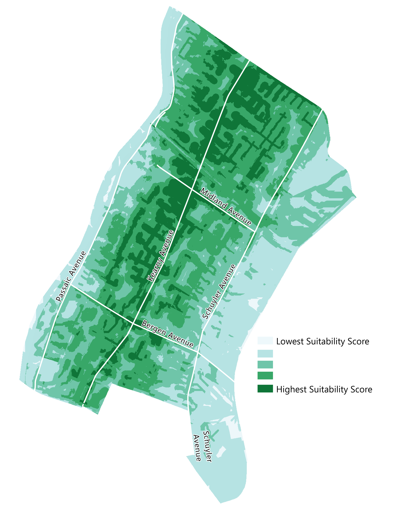

The students of the Coastal Resiliency Studio at the The Edward J. Bloustein School of Planning and Public Policy of Rutgers University worked with the Town of Kearny, New Jersey to better understand how precipitation events threatened the town and what measures the town could take to protect its infrastructure, mitigate urban flooding, and reduce combined sewer overflow events. 

Urban flooding from extreme precipitation events represents a threat to communities in New Jersey, both coastal and inland. Additionally, historical urban development – in fluvial floodplains, on top of streams that we’ve buried underground – creates greater problems today, as storms like these become more frequent due to climate change. And all too often, the neighborhoods of communities that tend to suffer these consequences are disproportionately those that have been historically marginalized, those with lower incomes, and communities of color. But communities are not helpless to let these events continue to wreak havoc. One way that urban flooding from extreme precipitation can be managed is through green infrastructure. Mainly used in communities today to prevent polluted stormwater runoff from reaching waterways, green infrastructure can be an important tool to reduce and even prevent urban flooding from affecting neighborhoods in areas at greatest risk. Using green infrastructure in this way requires planning, and that is what the studio explored for Kearny. 

Our two goals in siting green infrastructure in Kearny are to prevent flooding and to reduce the amount of stormwater entering the sewer system so that combined sewer overflow (CSO) events are reduced. To determine the most suitable sites for green infrastructure in Kearny, we conducted a suitability analysis using the mapping software ArcGIS Pro. Using this tool, we were able to incorporate a variety of criteria which would determine the effectiveness of green infrastructure throughout the Uplands in Kearny. The entirety of the Uplands was evaluated at a 10x10 foot resolution.

The four criteria used in the suitability analysis were:

#### **Elevation**

Green infrastructure sited at higher elevations can capture stormwater before it reaches lower elevations to cause flooding and before it enters the sewer system to cause CSO events. Accordingly, areas of higher elevation received higher scores in the analysis. 

  

#### **Impervious Surfaces**

Impervious surfaces, such as buildings and parking lots, cannot absorb stormwater, so it may either collect or run off, depending on the slope. Siting green infrastructure in areas with a high percentage of impervious surfaces increases that area’s ability to absorb stormwater. This both reduces flooding locally and reduces the volume of stormwater that can flow to lower elevations or enter the sewer system. In our analysis, we assigned higher scores to areas with a higher percentage of impervious surfaces.

  

#### **Modeled Runoff Flow**

Siting green infrastructure close to where precipitation runoff flows allows it to capture as much runoff as possible before it reaches lower elevations or enters the sewer system. We used the Hydrology toolset in ArcGIS Pro to create this model, which shows the location and direction of runoff flows. To measure the distance from runoff flows, the Euclidean Distance tool in ArcGis Pro was used. For our analysis, we assigned a higher score to areas closer to runoff flows. 

  

#### **Modeled Precipitation Accumulation**

Siting green infrastructure close to areas of precipitation accumulation can prevent localized flooding and capture accumulating stormwater before it can become runoff. Since our goal in siting green infrastructure is to capture stormwater before it reaches lower elevations or enters the sewer system, we only used modeled accumulation above 50 ft in elevation. The Euclidean Distance tool from ArcGIS Pro was used again to measure distance from the modeled accumulation, with  For our analysis, areas closer to modeled precipitation accumulation areas received higher scores. 

  

After evaluating the Kearny Uplands along each criteria, the average of the four scores were used to assign a score to each 10x10 foot section of the town, with higher scores indicating higher suitability.

> (Elevation score + Impervious Surfaces score + Runoff score + Precipitation accumulation score)/4 = Suitability Score

The resulting map is shown below. Areas in dark green received the highest suitability scores for green infrastructure while areas in white received the lowest scores.

  

We identified public spaces, streets, and rights-of-way as ideal sites for the Town to pilot green infrastructure installations. The map below shows all of the schools, parking lots, parks, and streets in Kearny which could be candidate sites for green infrastructure. The different categories of sites can be toggled on or off by the user and clicking on each site will display the suitability score for that location. 

Two context layers are also included: median income and the percent of people of color, both at the Census Blockgroup level. Allocating more resources to low-income people, people of color, and foreign-born populations promotes social equity for potentially vulnerable populations. We believe that public outreach around green infrastructure should focus on the south side of Uplands Kearny. In the event of limited funding, this side of town should receive priority consideration for green infrastructure projects, especially those offering beautification co-benefits. Siting of all green infrastructure projects, but especially those in socially vulnerable areas, should be finalized in collaboration with community members. Especially in socially vulnerable neighborhoods, buy-in and feedback should be sought before siting is finalized to make sure the project contributes to social cohesion, rather than diminishing it.

<iframe src="kearny_gi_webmap.html" height="855" width="110%"></iframe>

Sources: OpenStreetMap, NJGIN, NJDEP, American Community Survey 2019 5-Year, US Decennial Census.

Map created by the Mapping Team for the Coastal Resiliency Graduate Studio in Fall 2022 at the [Edward J. Bloustein School of Planning and Public Policy, Rutgers University](https://bloustein.rutgers.edu/). 
